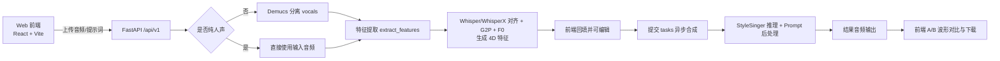

# StyleSinger Web 系统：基于文本提示词控制的歌声风格转换

[](./frontend)
[](./backend)
[](./StyleSinger)
[](./backend)
[](./frontend)
[](./StyleSinger/LICENSE)

## 目录
- [项目简介 (Project Overview)](#项目简介-project-overview)
- [研究意义与创新点 (Research Significance)](#研究意义与创新点-research-significance)
- [核心特性 (Key Features)](#核心特性-key-features)
- [技术栈 (Tech Stack)](#技术栈-tech-stack)
- [系统架构 (Architecture)](#系统架构-architecture)
- [项目结构 (Project Structure)](#项目结构-project-structure)
- [快速开始 (Getting Started)](#快速开始-getting-started)
- [接口速览 (API Quick Reference)](#接口速览-api-quick-reference)
- [开发状态与致谢 (Development Status & Acknowledgements)](#开发状态与致谢-development-status--acknowledgements)

## 项目简介 (Project Overview)
本项目是一个面向毕业设计场景的「文本提示词驱动歌声风格转换系统」，目标是将用户输入的风格描述（Style Prompt）映射到可控的歌声输出。  
当前代码库已实现从前端交互到后端推理的可运行闭环：

1. 上传原始音频（支持 `.wav/.mp3`）。
2. 自动人声分离（Demucs，可按 `is_vocal_only` 跳过）。
3. 自动提取并回填 4D 歌唱特征（`ph / note / note_dur / note_type`）。
4. 用户可视化编辑特征与风格强度。
5. 提交异步任务并轮询进度。
6. 返回风格化结果并支持 A/B 波形对比播放与下载。

说明：本仓库前端实际实现为 `React + Vite`（非 Vue）。

## 研究意义与创新点 (Research Significance)
本项目聚焦「可解释、可编辑、可部署」的歌声风格控制范式，适合作为本科毕设中的工程与算法结合案例。

1. 文本到风格控制的双路径设计  
主链路基于 `StyleSingerService._profile_from_prompt` 的风格映射与后处理调制。  
项目内同时保留了 `Sentence-BERT` 原型混合映射服务（`backend/app/models_svc/audio_style_service.py`），可作为实验分支用于文本语义到声学参数的相似度检索。

2. 四维特征自动化提取与质量门控  
后端将中文歌词/转写对齐到音素，并联合 F0 提取结果自动生成四维序列，附带质量指标（如 `micro_token_ratio`、`rest_ratio`）与软门控告警，减少人工标注门槛。

3. 节奏动态缩放与长音频兼容策略  
当未提供完整乐谱特征时，系统会依据参考音频时长与文本风格档位对 `note_dur` 动态缩放，支持无手工乐谱输入的可运行推理。

4. 从研究原型到公网可访问系统  
通过 `Vite 反向代理 + PM2 守护 + Featurize 端口暴露`，实现移动端可访问的完整演示链路，满足答辩展示稳定性要求。

## 核心特性 (Key Features)
### 1) 文本驱动的风格控制
- 前端输入 `Style Prompt` 与 `style_strength`（0~1）。
- 后端主链路根据关键词映射生成风格配置（音高、速度、亮度、饱和、混响、时长缩放）。
- 研究分支包含 Sentence-BERT 语义编码与原型插值（当前未挂接到默认 API 路由）。

### 2) 自动化 4D 特征提取
- 接口：`POST /api/v1/extract_features`
- 自动生成：
  - `Phoneme (ph)`：中文歌词 G2P，映射到 StyleSinger phone set。
  - `Note (note)`：由 F0 转 MIDI 并做稳健统计。
  - `Duration (note_dur)`：字级时间对齐后分配 initial/final 时长。
  - `Note Type (note_type)`：`1=rest`, `2=lyric`, `3=slur`。
- 内建清洗与约束：
  - 非法 phone 自动归一。
  - slur 合法性校正。
  - 微小时值合并与质量告警。

### 3) 内置人声分离
- 模块：`backend/app/models_svc/audio_processor.py`
- 算法：Demucs (`htdemucs`, `--two-stems vocals`)
- 行为：
  - 默认自动分离伴奏。
  - 若勾选“输入已是纯人声/干声”则跳过分离。
  - 分离失败会回退原音频，保证流程可继续。

### 4) 交互式可视化与异步任务
- 前端基于 `WaveSurfer.js` 实时渲染波形。
- 支持原始/转换结果 A/B 对比播放。
- 任务链路：`POST /tasks` -> `GET /tasks/{id}` -> `GET /tasks/{id}/result`
- 转换状态可视化：排队、分离、人声推理、完成/失败。

### 5) 增强特征栈可观测性
- 提供 `GET /api/v1/health`、`GET /api/v1/capabilities`。
- 可检查 enhanced 依赖状态（WhisperX、RMVPE、ffmpeg、NumPy/TensorFlow ABI 风险）。
- 默认策略为 `legacy`，仅在显式策略下启用 enhanced。

## 技术栈 (Tech Stack)
### 前端
- React 19
- Vite 7
- Tailwind CSS 4
- WaveSurfer.js 7
- Axios

### 后端
- FastAPI
- Python 3.10+
- Uvicorn
- BackgroundTasks（异步任务）

### 算法与音频处理
- StyleSinger 主推理引擎（`StyleSinger/inference/StyleSinger.py`）
- Whisper（默认字级时间戳）
- WhisperX（enhanced 可选）
- Parselmouth（默认 F0）
- RMVPE（enhanced 可选）
- Demucs（人声分离）

### 部署
- PM2 进程守护
- Featurize 端口转发（`featurize port export <port>`）

## 系统架构 (Architecture)


数据流简述：用户上传 -> Demucs 分离 -> 特征解析 -> StyleSinger 推理 -> 结果回填。

## 项目结构 (Project Structure)
```text
BS/
├── frontend/                  # React + Vite 前端
│   ├── src/App.tsx            # 页面主流程（上传、提取、提交任务、轮询、A/B对比）
│   └── vite.config.ts         # 0.0.0.0:3001 + /api 反向代理
├── backend/
│   ├── app/main.py            # FastAPI 入口
│   ├── app/api/endpoints/synthesis.py
│   ├── app/models_svc/stylesinger_wrapper.py
│   ├── app/models_svc/audio_processor.py
│   ├── requirements-core.txt
│   └── requirements-enhanced.txt
└── StyleSinger/               # 上游 StyleSinger 引擎代码与检查点
```

## 快速开始 (Getting Started)
### 1) 环境要求
- Python：`3.10+`（后端类型注解使用 `|` 联合类型）
- Node.js：`20.19+`（Vite 7 推荐）
- npm：`10+`
- ffmpeg：系统可执行命令
- 可选 GPU：用于更快推理（CPU 可运行但较慢）

### 2) 启动后端
```bash
cd /home/featurize/work/BS/backend
pip install -r requirements-core.txt
uvicorn app.main:app --host 0.0.0.0 --port 8000
```

可选增强栈（WhisperX + RMVPE）：
```bash
cd /home/featurize/work/BS/backend
pip install -r requirements-enhanced.txt
python scripts/setup_rmvpe.py
python scripts/check_enhanced_stack.py
```

### 3) 启动前端
```bash
cd /home/featurize/work/BS/frontend
npm install
npm run dev
```

当前 `vite.config.ts` 已配置：
- `host: 0.0.0.0`
- `port: 3001`
- `proxy /api -> http://127.0.0.1:8000`

### 4) 部署建议（Featurize 公网访问）
```bash
# 进入前端目录
cd /home/featurize/work/BS/frontend

# 安装 pm2（如未安装）
npm install -g pm2

# 后台守护前端开发服务
pm2 start npm --name bs-frontend --cwd /home/featurize/work/BS/frontend -- run dev
pm2 save

# 暴露前端端口
featurize port export 3001

# 查看日志（可选）
pm2 logs bs-frontend --lines 200
```

## 真实演示启动

当前默认主链路：`So-VITS-SVC`

高级模式：`StyleSinger`

后端启动：

```bash
bash scripts/start_real_svc_demo.sh
```

前端启动：

```bash
bash scripts/start_frontend_demo.sh
```

命令行验收：

```bash
bash scripts/run_sovits_real_cuda_check.sh
```

演示素材导出：

```bash
bash scripts/export_demo_assets.sh
```

当前模型说明：

- `minecraft_villager` 是技术验收模型，用于证明真实 So-VITS-SVC 推理链路已跑通。
- 它不代表最终演示目标音色，也不代表“清亮女声”“厚重女声”等最终效果模型。

## 接口速览 (API Quick Reference)
| Method | Path | 说明 |
|---|---|---|
| `GET` | `/api/v1/health` | 服务健康状态 + enhanced ready 标记 |
| `GET` | `/api/v1/capabilities` | 特征栈能力与缺失依赖 |
| `POST` | `/api/v1/extract_features` | 上传音频并自动提取 4D 特征 |
| `POST` | `/api/v1/tasks` | 创建异步风格转换任务 |
| `GET` | `/api/v1/tasks/{task_id}` | 查询任务状态 |
| `GET` | `/api/v1/tasks/{task_id}/result` | 下载任务结果音频 |
| `POST` | `/api/v1/synthesize` | 同步推理接口（调试/直出） |

## 开发状态与致谢 (Development Status & Acknowledgements)
### 开发状态
- 本项目为本科毕业设计工程化实现，重点验证文本驱动风格控制与 4D 特征自动化流程。
- 当前默认稳定链路为 `legacy` 提取模式（Whisper + Parselmouth）。
- `enhanced`（WhisperX + RMVPE）已具备依赖检测与脚本化安装能力，建议在独立环境中按文档启用。

### 致谢
- 感谢 StyleSinger 原始论文与开源实现提供核心模型基础。  
- 感谢 Whisper、WhisperX、Demucs、Parselmouth、RMVPE 等开源社区的技术支持。  
- 感谢 React、FastAPI、Vite、WaveSurfer.js 等工程生态为系统落地提供稳定基础。
